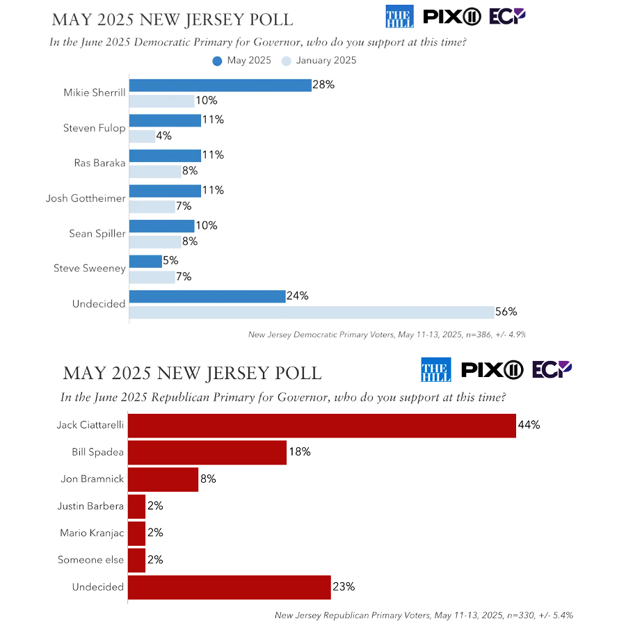

Levi Jiang &nbsp;
lfjiang@uw.edu
<br><br>

<span style="color:grey">Photo: The Philadelphia Inquirer</span>
<br><br>

# What is the story: 

The 2025 election for New Jersey’s Governor is getting intense. The New York Times has described it as “The race features the largest field in decades. The candidates have never been more accomplished or better funded. The results could be a bellwether for midterm congressional elections.”  

New Jersey is one of only two states (another one is Virginia) that holds a governor election in the year following a presidential election. For Democrats, it could reveal if they are winning back New Jersey voters who shifted right in the 2024 election. This makes the election an indicator of the popularity of the current Trump administration and the midterm elections in 2026. 

As the race heats up, my story will examine the source of each candidate's election funds, specifically, their donations. This article will disclose the identities of donors, and explore whether there are any patterns worth noting.
<br>

# Why NOW:

On June 10th, Six Democrats and five Republicans will compete in the primary on June 10th for their party’s nomination, and the winners will advance to the final election in November. The primaries are bound to attract public attention, and this is the right time to inform readers about the candidates' campaign finances.
<br>

# Target audience:

1. New Jersey residents who want to know more about their governor candidates
2. Election stakeholders (e.g., campaign staff, donors, potential donors)
3. Politicians, political analysts, commentators, enthusiasts (especially national politicians to see if political trends change following the Democrats' wipeout in the 2024 elections)
<br>

# Potential impact:
We want to help the readers deepen their understanding of this election and each candidate, motivate more people to vote, and facilitate their decision-making.
<br>

# Questions:

1. Who are the biggest donors for each candidate? How much did they donate? If we can find some connections between candidates and executives from health care corporations, union members etc, we can run deeper investigations on that.
2. Do certain candidates receive more donations from specific industries? 
3. Are there out-state contributors making significant impacts on the election? (And also for in-state donors, we can use their zip code to find some patterns.)
<br>

# Data Visualization (according to the questions):

1. A chart to show everyone’s top donors and their info.
2. A Sankey diagram to show which industries the donations come from.
3. A US map to show which states the donations are from. For in-state donations, we can use a NJ State map and show the areas that donations are from based on zip codes.
<br>

# Data Sources:

1. New Jersey ELEC Reports and Data Search System - candidate’s donation data (https://www.njelecefilesearch.com/searchcandidatereports)
2. Ballot Pedia - Info of each candidate (https://ballotpedia.org/New_Jersey_gubernatorial_and_lieutenant_gubernatorial_election,_2025)
3. New Jersey Globe - the latest headlines and results
(https://newjerseyglobe.com/)
<br>

# Previous Coverage:

- There’s not so much data analysis about this election. The New York Times has an article about who the candidates are and their political stances: 
(https://www.nytimes.com/2025/06/02/nyregion/new-jersey-governors-race-what-to-know.html)
(https://www.nytimes.com/interactive/2025/03/21/nyregion/new-jersey-governor-candidates-issues.html)

- Politico also analyzed everyone’s advantages and disadvantages:
(https://www.politico.com/interactives/2025/nj-governor-candidates-comparison-analysis/)

- Ballotpedia made a map of the results of New Jersey county Democratic Party conventions: 
(https://datawrapper.dwcdn.net/Ho3TT/3/)
<br>

# Other information:

At this point we know that there will be 11 candidates running for the Governor. Thoroughly analyzing all of them in a week will be difficult. Rob and I shared a great idea: analyze the top candidates in the polls. The idea of analyzing the rest of the candidates is the same as them, as is the visualization process. 

According to the newest poll conducted by Emerson College Polling in mid May, both parties had shown strong leanings on their top candidate. For the Democrats, Mikie Sherrill has a clear lead at the moment, followed by Steven Fulop, Ras Baraka, Josh Gottheimer and Sean Spiller in a neck-and-neck race. For Republicans, Jack Ciattarelli is way out in front. In this story, we will focus on the donations of Mikie Sherrill and Jack Ciattarelli (endorsed by Trump).

<div style="text-align: center;">
<br>
<span style="color:grey">Graphic: Emerson College Polling</span>
</div>
<br>
The New Jersey Election Law Enforcement Commission has the record of every candidate's donation record, and that is where we acquired all the data.

<div style="text-align: center;">
  
</div>
<br>

# Data Details
<br>
<b>Load software libraries</b>
```{r}

#install.packages("tidyverse")
#install.packages("janitor")
#install.packages("readxl")
#install.packages("rvest")
#install.packages("dplyr")
library(tidyverse)
library(janitor)
library(readxl)
library(rvest)
library(dplyr)

```

<b>Load data</b>
```{r}

sherrill <- read.csv("../data/sherrill_mikie_Cont_638821188859939969.csv") |> 
    clean_names() 
ciattarelli <- read.csv("../data/Ciattarelli_Jack_Cont_638845662827036224.csv") |> 
    clean_names() 


```

<b>Explore the data types</b>
```{r}

combo <- rbind(sherrill, ciattarelli)
glimpse(combo)

```
The data set has very detailed information of all the donations each candidate received. Donor's name, zip code, address, employer, data, etc. There are some errors with the data format to fix.
<br>

<b>Fix dates</b>
```{r}
combo <- combo |> 
  mutate(date = lubridate::mdy(contribution_date))
sherrill <- sherrill |> 
  mutate(date = lubridate::mdy(contribution_date))
ciattarelli <- ciattarelli |> 
  mutate(date = lubridate::mdy(contribution_date))

```

After that, we can have an overall picture of the donations.<br>

<b>Data exploration: totals by candidate</b>

```{r}

combo |> 
  select(entity_name, contribution_amount) |> 
  group_by(entity_name) |> 
   summarize(total = sum(contribution_amount)) |> 
  arrange(desc(total))

```

So we can see the huge gap between those two candidates. Ciattarelli's received donations are almost 7 times more than Sherrill's.<br><br>


# Questions

Put aside the difference we noticed, there's still some problem with our data. The original spreadsheet mix the individual donors and organizations, so we need to create an id for each donor. Also, some donors made more than one donation or changes the amount, then we need to figure out the exact money they donated.

```{r}
# Data Clean Up

# Step 1: Create a donor ID (individual name or organization name)
sherrill_donations_clean <- sherrill %>%
  mutate(
    donor_id = case_when(
      !is.na(first_name) & first_name != "" &
      !is.na(last_name) & last_name != "" ~ str_trim(paste(first_name, mi, last_name, suffix)),
      !is.na(non_ind_name) & non_ind_name != "" ~ str_trim(non_ind_name),
      TRUE ~ "Unknown"
    )
  )

# Step 2: Group by donor_id and sum up all contribution_amount
sherrill_donor_totals <- sherrill_donations_clean %>%
  group_by(donor_id) %>%
  summarise(final_donation = sum(contribution_amount, na.rm = TRUE), .groups = "drop")

# Step 3: Merge the final total back to the original dataset
sherrill_donations_with_total <- sherrill_donations_clean %>%
  left_join(sherrill_donor_totals, by = "donor_id")

# Step 4: Select relevant columns from the original data
sherrill_donor_details <- sherrill_donations_with_total %>%
  select(
    donor_id, final_donation, is_individual, date,
    street, city, state, zip,
    emp_name, emp_street, emp_city, emp_state, emp_zip,
    occupation_name, contributor_type
  )

# Step 5: Keep only the newest row for each donor based on date
# Convert date to proper Date type if it's not already
sherrill_donor_details <- sherrill_donor_details %>%
  mutate(date = as.Date(date))

sherrill_latest_details <- sherrill_donor_details %>%
  arrange(donor_id, desc(date)) %>%
  group_by(donor_id) %>%
  slice(1) %>%  # Keep only the newest record
  ungroup()

# Step 6: Double check all the data. For Sherrill's case, the zip format needs to be fixed
sherrill_latest_details <- sherrill_latest_details %>%
  mutate(zip = ifelse(nchar(zip) == 4, paste0("0", zip), as.character(zip)))


# So as for another candidate

ciattarelli_donations_clean <- ciattarelli %>%
  mutate(
    donor_id = case_when(
      !is.na(first_name) & first_name != "" &
      !is.na(last_name) & last_name != "" ~ str_trim(paste(first_name, mi, last_name, suffix)),
      !is.na(non_ind_name) & non_ind_name != "" ~ str_trim(non_ind_name),
      TRUE ~ "Unknown"
    )
  )

ciattarelli_donor_totals <- ciattarelli_donations_clean %>%
  group_by(donor_id) %>%
  summarise(final_donation = sum(contribution_amount, na.rm = TRUE), .groups = "drop")

ciattarelli_donations_with_total <- ciattarelli_donations_clean %>%
  left_join(ciattarelli_donor_totals, by = "donor_id")

ciattarelli_donor_details <- ciattarelli_donations_with_total %>%
  select(
    donor_id, final_donation, is_individual, date,
    street, city, state, zip,
    emp_name, emp_street, emp_city, emp_state, emp_zip,
    occupation_name, contributor_type
  )

ciattarelli_donor_details <- ciattarelli_donor_details %>%
  mutate(date = as.Date(date))

ciattarelli_latest_details <- ciattarelli_donor_details %>%
  arrange(donor_id, desc(date)) %>%
  group_by(donor_id) %>%
  slice(1) %>%
  ungroup()


```
<br>
<b>Q1: Who are the biggest donors for each candidate? How much did they donate? (If we can find some connections between candidates and executives from health care corporations, union members etc, we can run deeper investigations on that.)</b>

For candidate Mikie Sherrill:

```{r}

sherrill_top_donations <- sherrill_latest_details %>%
  arrange(desc(final_donation)) %>%
  slice_head(n = 200)

```
 <br>
<iframe title="Mikie Sherrill‘s Top Donors" aria-label="Table" id="datawrapper-chart-xsKid" src="https://datawrapper.dwcdn.net/xsKid/3/" scrolling="no" frameborder="0" style="width: 0; min-width: 100% !important; border: none;" height="400" data-external="1"></iframe><script type="text/javascript">!function(){"use strict";window.addEventListener("message",(function(a){if(void 0!==a.data["datawrapper-height"]){var e=document.querySelectorAll("iframe");for(var t in a.data["datawrapper-height"])for(var r,i=0;r=e[i];i++)if(r.contentWindow===a.source){var d=a.data["datawrapper-height"][t]+"px";r.style.height=d}}}))}();
</script>
<br>

As we can see, the money they donated are the same, so it's hard to tell who's the "biggest" boss. According to NJ Election Law Enforcement Commission, $5,800 is the donation limit to individual candidates. Among Sherrill's 525 donors, 178 of them <span style="color:blue"><b>(34%)</b></span> had reached the donation limit.

We can also make a table of these donors:<br><br>


And for candidate Jack Ciattarelli:
 
```{r}

ciattarelli_top_donations <- ciattarelli_latest_details %>%
  arrange(desc(final_donation)) %>%
  slice_head(n = 200)

```

<br>
<iframe title="Jack Ciattarelli‘s Top Donors" aria-label="Table" id="datawrapper-chart-9WytX" src="https://datawrapper.dwcdn.net/9WytX/3/" scrolling="no" frameborder="0" style="width: 0; min-width: 100% !important; border: none;" height="400" data-external="1"></iframe><script type="text/javascript">!function(){"use strict";window.addEventListener("message",(function(a){if(void 0!==a.data["datawrapper-height"]){var e=document.querySelectorAll("iframe");for(var t in a.data["datawrapper-height"])for(var r,i=0;r=e[i];i++)if(r.contentWindow===a.source){var d=a.data["datawrapper-height"][t]+"px";r.style.height=d}}}))}();
</script><br>


The top donor has drawn our attention: NJ Election Law Enforcement Commission. The record shows that Commission will provide $5.5 million public matching fund, which is also the Primary Public Fund Cap, for candidate Ciattarelli. And in exchange, Ciattarelli must follow the $8.7 million Primary Expenditure Limit. Candidate Sherrill is also qualified for the maximum public fund of $5.5 million, but she hasn't officialy used that for her race. 

Besides that, for Ciattarelli, there are 192 of 2120 donors <span style="color:red"><b>(9%)</b></span> reached the donation limit. Thus, although Sherrill had significantly fewer donations and donors than Ciattarelli, a higher percentage of her donors made big donations.

We can also dig deeper in this topic. E.g. Check the distribution of their received donations and see how many of them are big donations, and how many of them are grassroots donations (donations from individuals of less than $200). Ciattarelli once told the New Jersey Globe that “I am proud to say that thanks to an outpouring of support from residents in all 21 counties, including over $200,000 in grassroots donations of $200 or less... We are now in the strongest possible position to get our message out and win in November.” Which is somewhat true. And for Sherrill, suprisingly, none of her received donations is under $200. That probably means Sherrill is more appealing to middle and upper class, while Ciattarelli is good at geting along with the working class.

<br>

<div style="text-align:center;">
<iframe title="Sherrill's Donation Type Distribution" aria-label="Bar Chart" id="datawrapper-chart-HlTc7" src="https://datawrapper.dwcdn.net/HlTc7/3/" scrolling="no" frameborder="0" style="width: 0; min-width: 70% !important; border: none;" height="247" data-external="1"></iframe><script type="text/javascript">!function(){"use strict";window.addEventListener("message",(function(a){if(void 0!==a.data["datawrapper-height"]){var e=document.querySelectorAll("iframe");for(var t in a.data["datawrapper-height"])for(var r,i=0;r=e[i];i++)if(r.contentWindow===a.source){var d=a.data["datawrapper-height"][t]+"px";r.style.height=d}}}))}();
</script>
</div>
<br>
<div style="text-align:center;">
<iframe title="Ciattarelli's Donation Type Distribution" aria-label="Bar Chart" id="datawrapper-chart-LVEoj" src="https://datawrapper.dwcdn.net/LVEoj/2/" scrolling="no" frameborder="0" style="width: 0; min-width: 70% !important; border: none;" height="247" data-external="1"></iframe><script type="text/javascript">!function(){"use strict";window.addEventListener("message",(function(a){if(void 0!==a.data["datawrapper-height"]){var e=document.querySelectorAll("iframe");for(var t in a.data["datawrapper-height"])for(var r,i=0;r=e[i];i++)if(r.contentWindow===a.source){var d=a.data["datawrapper-height"][t]+"px";r.style.height=d}}}))}();
</script>
</div><br><br>


<b>Q2: Do certain candidates receive more donations from specific industries? </b>
<br>

Unfortunately, the data from NJ ELEC doesn't directly tell us what industries are these donors working in. But if we are going to get deeper in this topic, we can track their employer's public record and make classifications by ourselves. <br>

What we do know is for every donor, they need to let ELEC know their occupations. Based on that, we can analyze what kind of jobs do donors have.<br>

For Sherrill:

```{r}

donations_money_by_occupation_sherrill <- sherrill_latest_details %>%
  group_by(occupation_name) %>%
  summarise(Total = sum(final_donation), .groups = "drop") %>%
  arrange(desc(Total))
print(donations_money_by_occupation_sherrill)

```

<div style="text-align:center;" >
<iframe src='https://flo.uri.sh/visualisation/23632320/embed' title='Interactive or visual content' class='flourish-embed-iframe' frameborder='0' scrolling='no' style='width:100%;height:600px;' sandbox='allow-same-origin allow-forms allow-scripts allow-downloads allow-popups allow-popups-to-escape-sandbox allow-top-navigation-by-user-activation'></iframe><div style='width:100%!;margin-top:4px!important;text-align:right!important;'><a class='flourish-credit' href='https://public.flourish.studio/visualisation/23632320/?utm_source=embed&utm_campaign=visualisation/23632320' target='_top' style='text-decoration:none!important'> </a></div>

</div><br>

For Ciattarelli:
```{r}

donations_money_by_occupation_ciattarelli <- ciattarelli_latest_details %>%
  group_by(occupation_name) %>%
  summarise(Total = sum(final_donation), .groups = "drop") %>%
  arrange(desc(Total))
print(donations_money_by_occupation_ciattarelli)

```

<br>
Due to the $5.5 million public fund was labled as "Null (Not specified)", which will impact our analysis result, we excluded that money before making the graphic.<br>

<div style="text-align:center;" >

<iframe src='https://flo.uri.sh/visualisation/23635515/embed' title='Interactive or visual content' class='flourish-embed-iframe' frameborder='0' scrolling='no' style='width:100%;height:600px;' sandbox='allow-same-origin allow-forms allow-scripts allow-downloads allow-popups allow-popups-to-escape-sandbox allow-top-navigation-by-user-activation'></iframe><div style='width:100%!;margin-top:4px!important;text-align:right!important;'><a class='flourish-credit' href='https://public.flourish.studio/visualisation/23635515/?utm_source=embed&utm_campaign=visualisation/23635515' target='_top' style='text-decoration:none!important'> </a></div>

</div><br>

So we can see a clear difference here. The largest number of contributors to Sherrill were retired individuals, followed by managers, attorneys, and consultants. And the largest percentage of those who contributed to Ciattarelli were business managers, unspecified, retirees, business owners, and real estate professionals.

<br>

<b>Q3: Are there out-state contributors making significant impacts on the election? (And also for in-state donors, we can use their zip code to find some patterns.)</b>

For Mikie Sherrill:

```{r}

donations_money_by_state_sherrill <- sherrill_latest_details %>%
  group_by(state) %>%
  summarise(Total = sum(final_donation), .groups = "drop") %>%
  arrange(desc(Total))
print(donations_money_by_state_sherrill)

```

<b>64%</b> of the contributions were from within the state. In addition to New Jersey, supporters in 20 other states have donated to her. The states with big donations are New York, California, Florida, Washington, D.C., Massachusetts, and Virginia.
<br><br>

<div style="text-align:center;">
<iframe title="Sherrill Nationwide Donations" aria-label="Map" id="datawrapper-chart-5z5TC" src="https://datawrapper.dwcdn.net/5z5TC/4/" scrolling="no" frameborder="0" style="width: 0; min-width: 60% !important; border: none;" height="400" data-external="1"></iframe><script type="text/javascript">!function(){"use strict";window.addEventListener("message",(function(a){if(void 0!==a.data["datawrapper-height"]){var e=document.querySelectorAll("iframe");for(var t in a.data["datawrapper-height"])for(var r,i=0;r=e[i];i++)if(r.contentWindow===a.source){var d=a.data["datawrapper-height"][t]+"px";r.style.height=d}}}))}();
</script>
</div>
<br><br>

For Jack Ciattarelli:


```{r}

donations_money_by_state_ciattarelli <- ciattarelli_latest_details %>%
  group_by(state) %>%
  summarise(Total = sum(final_donation), .groups = "drop") %>%
  arrange(desc(Total))
print(donations_money_by_state_ciattarelli)

```

<b>94%</b> of the contributions were from New Jersey, which is much higher than Sherrill's since Ciattarelli got the $5.5 million in-state public fund. However, 0.6% of the contributions could not be traced to the state of origin. Besides NJ, there are other 25 states have donation records. The states with the larger donations are New York, Florida, Pennsylvania, and California.
<br><br>

<div style="text-align:center;">
<iframe title="Ciattarelli Nationwide Donations" aria-label="Map" id="datawrapper-chart-zRaVm" src="https://datawrapper.dwcdn.net/zRaVm/10/" scrolling="no" frameborder="0" style="width: 0; min-width: 60% !important; border: none;" height="400" data-external="1"></iframe><script type="text/javascript">!function(){"use strict";window.addEventListener("message",(function(a){if(void 0!==a.data["datawrapper-height"]){var e=document.querySelectorAll("iframe");for(var t in a.data["datawrapper-height"])for(var r,i=0;r=e[i];i++)if(r.contentWindow===a.source){var d=a.data["datawrapper-height"][t]+"px";r.style.height=d}}}))}();
</script>
</div>
<br><br><br>

We can also check the number of donors for each state:

```{r}
donations_amount_by_state_sherrill <- sherrill_latest_details %>%
  group_by(state) %>%
  summarise(Count = n(), .groups = "drop") %>%
  arrange(desc(Count))
print(donations_amount_by_state_sherrill)
```

In the case of Sherrill, for example, even though the amount of donations from Connecticut was not as high as Virginia and Pennsylvania, the number of donors was actually higher. This means that more large donations come from Connecticut.

However, in this article, the number of out-state contributors are relatively small, making it possible to produce a polarized analysis. While the number of donors is also an important indicator of a candidate's popularity, we won't prioritize it for now.
<br><br><br>

For in-state donors, their zip codes are available in the dataset, so we can analyze the donations in the area corresponding to the zip code.

For Mikie Sherrill:
```{r}

in_state_donations_sherrill <- sherrill_latest_details %>%
  filter(state == "NJ") %>%
  group_by(zip) %>%
  summarise(total_donation = sum(final_donation, na.rm = TRUE)) %>%
  arrange(desc(total_donation))
print(in_state_donations_sherrill)

```
<br>

<div style="text-align:center;">
<iframe title="Sherrill In-State Donations" aria-label="Map" id="datawrapper-chart-P6u7J" src="https://datawrapper.dwcdn.net/P6u7J/4/" scrolling="no" frameborder="0" style="width: 0; min-width: 60% !important; border: none;" height="400" data-external="1"></iframe><script type="text/javascript">!function(){"use strict";window.addEventListener("message",(function(a){if(void 0!==a.data["datawrapper-height"]){var e=document.querySelectorAll("iframe");for(var t in a.data["datawrapper-height"])for(var r,i=0;r=e[i];i++)if(r.contentWindow===a.source){var d=a.data["datawrapper-height"][t]+"px";r.style.height=d}}}))}();
</script>
</div>
<br>

Zip code 07043, which means the Upper Montclair area, has the most donations.The donations she received are concentrated in northern New Jersey. According to Ballotpedia, this is actually in line with what she got in the New Jersey county Democratic Party conventions.
<br><br>

<br><br>

For Jack Ciattarelli:
```{r}

in_state_donations_ciattarelli <- ciattarelli_latest_details %>%
  filter(state == "NJ") %>%
  group_by(zip) %>%
  summarise(total_donation = sum(final_donation, na.rm = TRUE)) %>%
  arrange(desc(total_donation))
print(in_state_donations_ciattarelli)

```

Zip code 08625-0185 and the $5.5 million donation is from NJ Election Law Enforcement Commission, which doesn't means this area's residents donated to him. We will delete it and then draw the map.

<br>
<div style="text-align:center;">
<iframe title="Ciattarelli In-State Donations" aria-label="Map" id="datawrapper-chart-OkhBR" src="https://datawrapper.dwcdn.net/OkhBR/5/" scrolling="no" frameborder="0" style="width: 0; min-width: 60% !important; border: none;" height="400" data-external="1"></iframe><script type="text/javascript">!function(){"use strict";window.addEventListener("message",(function(a){if(void 0!==a.data["datawrapper-height"]){var e=document.querySelectorAll("iframe");for(var t in a.data["datawrapper-height"])for(var r,i=0;r=e[i];i++)if(r.contentWindow===a.source){var d=a.data["datawrapper-height"][t]+"px";r.style.height=d}}}))}();
</script>
</div>
<br>

Ciattarelli got most donations from Princeton, NJ 08540. His in-state contributions are obviously spread over a much wider area and gave him big popularity in central New Jersey.
<br><br>

# Summary:
1. Mikie Sherrill has more big donors and donations, and is taking control of northern NJ. She still needs to work harder on grassroot individuals and organizations.
2. Jack Ciattarelli seems more appealing to working class, and has donors from more diverse backgrounds. He's building his popularity around the whole state.
3. Both of them are mostly relying on in-state supports, but Ciattarelli has more money and donors from more other states, and also a large amount of money without original state.
<br>

# Problems:
1. The $5.5M public funding makes comparisons harder.
2. How to find out what industries are there money from?
3. How to link their political stances to their money?
<br>

# Sources:<br>
https://www.nytimes.com/2025/06/02/nyregion/new-jersey-governors-race-what-to-know.html<br>
https://www.fox5ny.com/news/trumps-pick-new-jersey-governor-jack-ciattarelli<br>
https://www.elec.nj.gov/pdffiles/press_releases/pr_2025/pr_05292025.pdf<br>
https://datawrapper.dwcdn.net/Ho3TT/3/<br>
https://newjerseyglobe.com/fr/ciattarelli-raises-a-colossal-2-9-million-and-qualifies-for-a-full-match/<br>

<br><br><br><br><br><br>
